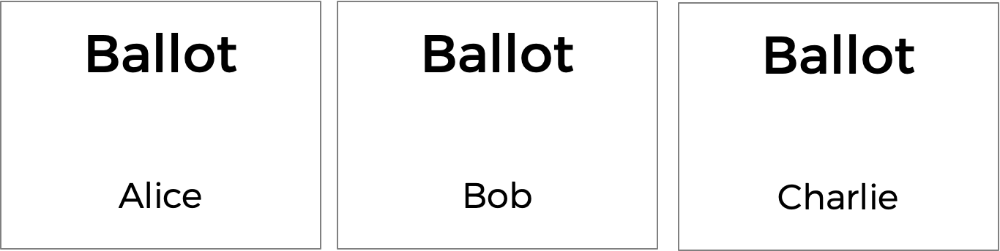
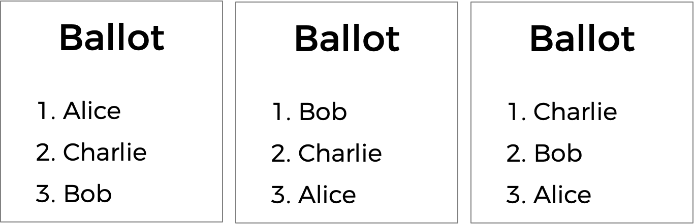
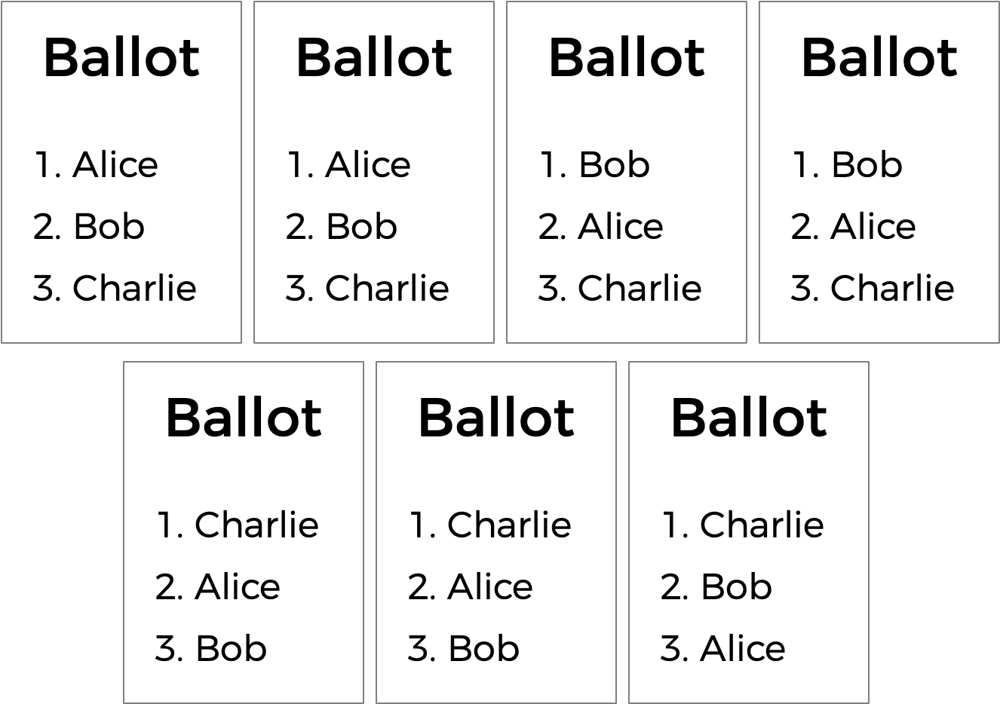
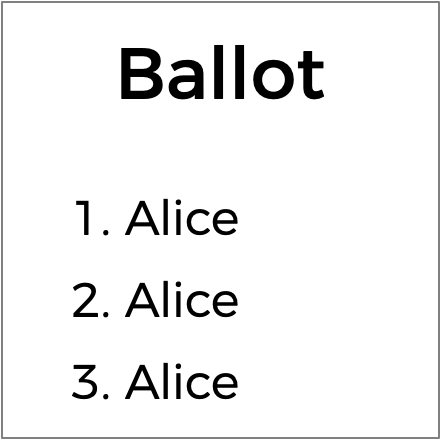

# Borda

Implement a program that runs a Borda count election, per the below.

```
$ ./borda Alice Bob Charlie
Number of voters: 3
Rank 1: Alice
Rank 2: Bob
Rank 3: Charlie

Rank 1: Bob
Rank 2: Alice
Rank 3: Charlie

Rank 1: Charlie
Rank 2: Bob
Rank 3: Alice

Bob
```

## Getting Started

Here's how to download this problem's "distribution code" (i.e., starter code) into your own CS50 IDE. Log into [CS50 IDE](https://ide.cs50.io/) and then, in a terminal window, execute each of the below.

* Execute `cd` to ensure that you're in `~/` (i.e., your home directory).
* Execute `cd pset3` to change into (i.e., open) your `pset3` directory that should already exist.
* Execute `wget TODO` to download a (compressed) ZIP file with this problem's distribution.
* Execute `unzip borda.zip` to uncompress that file.
* Execute `rm borda.zip` followed by `yes` or `y` to delete that ZIP file.
* Execute `ls`. You should see a directory called `borda`, which was inside of that ZIP file.
* Execute `cd borda` to change into that directory.
* Execute `ls`. You should see this problem's distribution code, in a file called `borda.c`.

## Background

You already know about plurality elections, which follow a very simple algorithm for determining the winner of an election: every voter gets one vote, and the candidate with the most votes wins.

But the plurality vote does have some disadvantages. What happens, for instance, in an election with three candidates, and the ballots below are cast?



A plurality vote would here declare a tie between the three candidates, since each has one vote. But is that the right outcome?

There's another kind of voting system known as a ranked-choice voting system. In a ranked-choice system, voters can vote for more than one candidate. Instead of just voting for their top choice, they can rank their top choices. The resulting ballots might therefore look like the below.



Here, each voter, in addition to specifying their first preference candidate, has also indicated their second and third choices. And now, what was previously a tied election can now have a winner: Charlie, though he received just one first-preference vote, was the second preference for the other two voters, and is thus arguably the best choice of a winner out of the three.

Ranked choice voting can also solve yet another potential drawback of plurality voting. Take a look at the following ballots.



Who should win this election? In a plurality vote where each voter chooses their first preference only, Charlie wins this election with three votes compared to only two for each of Alice and Bob. But a majority of the voters (4 out of the 7) would be happier with either Alice or Bob instead of Charlie. By considering ranked preferences, a voting system may be able to choose a winner that better reflects the preferences of the voters.

One such ranked choice voting system is the Borda count. In the Borda count system, candidates compete for the most number of "points," rather than the most number of votes. In a Borda count election with three candidates, a voter's first preference would get 3 points, their second preference would get 2 points, and their third preference gets 1 point.

More generally, if there are `n` candidates in the election, each first preference vote gets `n` points, second preference votes get `n - 1` points, etc.

The Borda count also doesn't require that every voter rank all candidates. If there are five total candidates, and a voter only ranks their top two preferences, then the first preference gets 5 points, the second preference gets 4 points, and all other candidates get 1 point (unranked candidates always get 1 point).

But be careful! A clever voter may try to cheat the system by ranking their preferred candidate more than once.



If the person counting the votes isn't careful, Alice might end up with 6 points (3 + 2 + 1) instead of the ordinary maximum of 3 points for a 3-person election. For that reason, whoever's counting the votes (today, that's you!) had better be careful not to let the same candidate get ranked more than once.

At the end of the election, whoever has the most points is declared the winner! (Of course, ties are still possible, in which case there may be multiple winners).

## Understanding

Let's open up `borda.c` and take a look at the distribution code. You'll notice that this code has a lot in common with the code for the plurality election. Again, we have a `MAX` for the maximum number of candidates in the election. We also have an array of `candidates`, and a `count` of the number of candidates in the election. Instead of an array of vote totals, though, we now have an array of `points` instead, to keep track of each candidate's point total.

The `main` function still popualtes the array of `candidates`, and gets the total number of voters.

Inside of the main `for` loop, though, is where things get a bit different.

Notice that for every voter, we initialize an array called `ranks`. This array represents the rank given to each candidate for the current voter. `ranks[2]`, for example, would be the rank given to the candidate at index 2 in the `candidates` array. If `ranks[2] == 3`, that means that the candidate whose name is stored at `candidates[2]` is the voter's third preference.

All ranks are initialized to `0`, so you can take a rank of `0` to mean that a candidate is "unranked."

The voter is then prompted to type in each of their preferences, in order. (A voter can stop ranking candidates at any time by leaving their input field blank.) As the program receives each rank, the rank is passed into the function `add_rank` to keep track of the newly added rank.

Notice that if a user enters an invalid rank (as by ranking a candidate not on the ballot, or ranking the same candidate twice), the ballot is declared invalid and none of their ranks are counted.

After all ranks are entered, the `update_points` function is called, which takes as input all of the ranks for this ballot, and should update the point totals for each of the candidates.

Finally, at the end of the election, the program prints out the winner (or winners) of the election.

Of course, several of the functions — `add_rank`, `update_points`, and `print_winner` in particular — have been left unimplemented. That's where you come in!

## Specification

Complete the implementation of `borda.c` in such a way that it simulates a Borda count election.

* Complete the `add_rank` function.
	* The function takes in three arguments:
	  * an array `ranks`, representing the ranks so far on the current voter's ballot (where `ranks[i]` represents the current rank for candidate `i`). A rank of `0` means the candidate is currently unranked,
	  * a string `candidate`, representing the candidate that has just been ranked, and
	  * an integer `rank`, representing the rank that has been given to the candidate `candidate`.
	* The function should behave as follows:
	  * If `candidate` matches (case-insensitively) one of the names of the candidate in the election, and that candidate has yet to be ranked by the current voter, then update the `ranks` array to indicate the candidate's rank. The `add_rank` function should in this case should return `true` to indicate a successful rank.
	  * If `candidate` does not match any of the candidates in the election, or it matches a candidate who has already been ranked, then the `ranks` array should be left unchanged, and the `add_rank` function should return `false` to indicate an invalid ballot.
* Complete the `update_points` function.
  * The function takes a single argument, an array of `ranks`, where `ranks[i]` is the rank for candidate `i`, and `0` represents an unranked candidate.
  * The function should update the current point totals for each candidate. Recall that in a Borda count election with `n` candidates, the first ranked candidate gets `n` points, the second preference gets `n - 1`, the third preference gets `n - 2` points, and so forth, with all unranked candidates receiving 1 point.
* Complete the `print_winner` function.
  * The `print_winner` function should print out the name of the candidate who received the most points in the election, and then print a newline.
  * It is possible that the election could end in a tie if multiple candidates each have the maximum number of points. In that case, you should output the names of each of the winning candidates, each on a separate line.
 
## Walkthrough

TODO

## Usage

Your program should behave per the examples below:

```
$ ./borda Alice Bob Charlie
Number of voters: 2
Rank 1: Alice
Rank 2: Bob
Rank 3: Charlie

Rank 1: Charlie
Rank 2: Alice
Rank 3: Bob

Alice
```

```
$ ./borda Alice Bob Charlie
Number of voters: 2
Rank 1: Alice
Rank 2: Bob
Rank 3: Charlie

Rank 1: Bob
Rank 2: Bob
Invalid vote.

Alice
```

```
$ ./borda Alice Bob Charlie
Number of voters: 2
Rank 1: Alice
Rank 2: Charlie
Rank 3: Bob

Rank 1: Bob
Rank 2: Charlie
Rank 3: David
Invalid vote.

Alice
```

## Hints

* You may find the [strcasecmp](https://man.cs50.io/3/strcasecmp) function helpful for comparing whether two strings are identical.

## Testing

Be sure to test your code to make sure it handles...

* An election with any number of candidate (up to the `MAX` of `9`)
* Voting for a candidate by name, case-insensitively
* Invalid votes for candidates who are not on the ballot
* Invalid votes where a candidate is ranked more than once
* Printing the winner of the election if there is only one
* Printing the winner of the election if there are multiple winners

## How to Submit

TODO