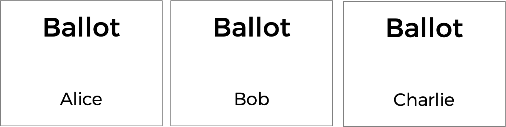
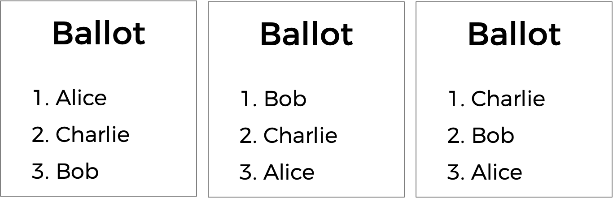
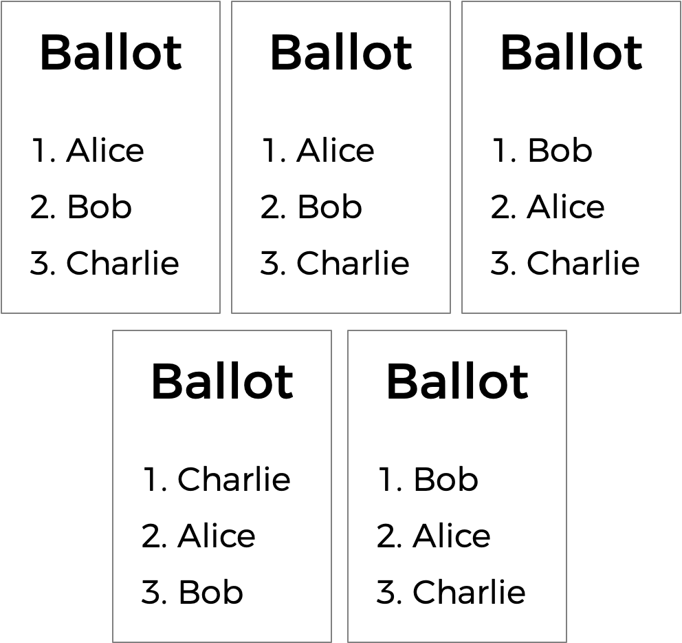

# Runoff

Implement a program that runs a runoff election, per the below.

```
./runoff Alice Bob Charlie
Number of voters: 5
Rank 1: Alice
Rank 2: Charlie
Rank 3:

Rank 1: Alice
Rank 2: Charlie
Rank 3:

Rank 1: Bob
Rank 2: Charlie
Rank 3:

Rank 1: Bob
Rank 2: Charlie
Rank 3:

Rank 1: Charlie
Rank 2: Alice
Rank 3:

Alice
```

## Getting Started

Here's how to download this problem's "distribution code" (i.e., starter code) into your own CS50 IDE. Log into [CS50 IDE](https://ide.cs50.io/) and then, in a terminal window, execute each of the below.

* Execute `cd` to ensure that you're in `~/` (i.e., your home directory).
* Execute `cd pset3` to change into (i.e., open) your `pset3` directory that should already exist.
* Execute `wget TODO` to download a (compressed) ZIP file with this problem's distribution.
* Execute `unzip runoff.zip` to uncompress that file.
* Execute `rm runoff.zip` followed by `yes` or `y` to delete that ZIP file.
* Execute `ls`. You should see a directory called `runoff`, which was inside of that ZIP file.
* Execute `cd runoff` to change into that directory.
* Execute `ls`. You should see this problem's distribution code, in a file called `runoff.c`.

## Background

You already know about plurality elections, which follow a very simple algorithm for determining the winner of an election: every voter gets one vote, and the candidate with the most votes wins.

But the plurality vote does have some disadvantages. What happens, for instance, in an election with three candidates, and the ballots below are cast?



A plurality vote would here declare a tie between the three candidates, since each has one vote. But is that the right outcome?

There's another kind of voting system known as a ranked-choice voting system. In a ranked-choice system, voters can vote for more than one candidate. Instead of just voting for their top choice, they can rank their top choices. The resulting ballots might therefore look like the below.



Here, each voter, in addition to specifying their first preference candidate, has also indicated their second and third choices. And now, what was previously a tied election can now have a winner: Charlie, though he received just one first-preference vote, was the second preference for the other two voters, and is thus arguably the best choice of a winner out of the three.

Ranked choice voting can also solve yet another potential drawback of plurality voting. Take a look at the following ballots.



Who should win this election? In a plurality vote where each voter chooses their first preference only, Charlie wins this election with four votes compared to only three for Bob and two for Alice. But a majority of the voters (5 out of the 9) would be happier with either Alice or Bob instead of Charlie. By considering ranked preferences, a voting system may be able to choose a winner that better reflects the preferences of the voters.

One such ranked choice voting system is the instant runoff system. In an instant runoff election, voters can rank as many candidates as they wish. If any candidate has a majority (more than 50%) of the first preference votes, that candidate is declared the winner of the election.

If no candidate has a majority, then an "instant runoff" occurrs. The candidate who received the fewest number of votes is eliminated from the election, and anyone who originally chose that candidate as their first preference now has their second preference considered. Why do it this way? Effectively, this simulates what would have happened if the least popular candidate had not been in the election to begin with.

The process repeats: if no candidate has a majority of the votes, the last place candidate is eliminated, and anyone who voted for them will instead vote for their next preference (who hasn't themselves already been eliminated). Once a candidate has a majority, that candidate is declared the winner.

Let's consider the following ballots and explore how a runoff election would take place.


Alice has two votes, Bob has two votes, and Charlie has one vote. To win an election with five people, a majority (three votes) is required. Since nobody has a majority, a runoff needs to be held. Charlie has the fewest number of votes (with only one), so Charlie is eliminated. The voter who originally voted for Charlie listed Alice as second preference, so Alice gets the extra vote. Alice now has three votes, and Bob has two votes. Alice now has a majority, and Alice is declared the winner.

What corner cases do we need to consider here?

One possibility is that there's a tie for who should get eliminated. We can handle that scenario by saying all candidates who are tied for last place will be eliminated. If every remaining candidate has the exact same number of votes, though, eliminating the tied last place candidates means eliminating everyone! So in that case, we'll just declare the election a tie between all remaining candidates.

We also need to consider what happens with ballots that don't rank all of their preferences. Say someone only ranks two of the five candidates in an election, but both of those candidates have been eliminated. What happens if both of their preferences have been eliminated, but the election doesn't have a winner yet? Recall that in the runoff process, we simulate what would have happened if the eliminated candidates hadn't been in the election at all. In that case, since our hypothetical voter only voted for candidates who were eliminated, then in this stage of the runoff, the voter doesn't vote at all: none of their preferences count anymore, and the voter doesn't even count towards the total number of voters in the election.

Sounds a bit more complicated than a plurality vote, doesn't it? But it arguably has the benefit of being an election system where the winner of the election more accurately represents the preferences of the voters.

## Understanding

Let's open up `runoff.c` to take a look at what's already there. We're defining a few constants: `MAX_CANDIDATES` for the maximum number of candidates in the election, `MAX_VOTERS` for the maximum number of voters in the election, and `NO_CANDIDATE`, a special so-called "sentinel value" that will be used to represent the absence of a candidate preference. Recall that each candidate is numbered by their index in an array, so `-1` is a safe choice for a value that won't be taken by any other candidate.

Next up is a two-dimensional array `prefs`. The array `prefs[i]` will represent all of the preferences for voter number `i`, and the integer `prefs[i][j]` here will store the index of the candidate who is the `j`th preference for voter `i`.

We also have three one-dimensional arrays: an array of `candidates` and an array of `votes`, much like the plurality election, but also a boolean array called `eliminated`. This array will keep track of which candidates have already been eliminated from the race. The program also has two global variables: `voter_count` and `candidate_count`.

Now onto `main`. Notice that after determining the number of candidates and the number of voters, the main voting loop begins, giving every voter a chance to vote. At first, all of the voter's preferences are set to `NO_CANDIDATE`, since they haven't ranked anyone yet. As the voter enters their preferences, the `record_preference` function is called to keep track of all of the preferences. If at any point, the ballot is deemed invalid, the ballot is canceled, with all of the preferences set back to `NO_CANDIDATE`.

Once all of the votes are in, another loop begins: this one's going to keep looping through the runoff process of checking for a winner and eliminating the last place candidate until there is a winner.

The first call here is to a function called `tabulate`, which should look at all of the voters' preferences and compute the current vote totals, by looking at each voter's top choice candidate who hasn't yet been eliminated. If there's a winner, their name is printed (via a call to `print_winner`) and the program is over. But otherwise, the program needs to determine the minimum number of votes a candidate has (via a call to `get_minimum`), and then eliminate any candidate who has that number of votes (via a call to `eliminate`).

If you look a bit further down in the file, you'll see that these functions — `record_preference`, `tabulate`, `print_winner`, `get_minimum`, and `eliminate` — are all left to up to you to complete!

## Specification

Complete the implementation of `runoff.c` in such a way that it simulates a runoff election.

* Complete the `record_preference` function.
  * The function takes arguments `voter`, `rank`, and `candidate`. If `candidate` is a (case-insensitive) match for the name of a valid candidate, then you should update the global preferences array to indicate that the voter `voter` has the `candidate` as their `rank` preference.
  * If the preference is successfully recorded, the function should return `true`; the function should return `false` otherwise (if, for instance, `candidate` is not the name of one of the candidates).
* Complete the `tabulate` function.
  * At the end of the a call to `tabulate`, the `votes` array should reflect the number of votes that each candidate has at this stage in the runoff.
  * Recall that at each stage in the runoff, every voter effectively votes for their top-preferred candidate who has not already been eliminated.
  * The function should return the number of voters who are still relevant to the election. A voter is no longer relevant if all of their recorded preferences have been eliminated.
* Complete the `print_winner` function.
  * The function takes a single argument, `total`, indicating the number of relevant voters left in the election.
  * If a candidate has a vote count greater than half of the `total`, their name should be printed to `stdout` and the function should return `true`.
  * If nobody has won the election yet, the function should return `false`.
* Complete the `get_minimum` function.
  * The function should return the minimum number of votes that any candidate who has not yet been eliminated has.
* Complete the `eliminate` function.
  * The function takes as argument `min`, the minimum number of votes that any candidate who has not yet been eliminated has.
  * The function should update the `eliminated` array such that any candidate who has only `min` votes is eliminated.

## Walkthrough

TODO

## Usage

Your program should behave per the examples: below:

```
./runoff Alice Bob Charlie
Number of voters: 5
Rank 1: Alice
Rank 2: Charlie
Rank 3:

Rank 1: Alice
Rank 2: Charlie
Rank 3:

Rank 1: Bob
Rank 2: Charlie
Rank 3:

Rank 1: Bob
Rank 2: Charlie
Rank 3:

Rank 1: Charlie
Rank 2: Alice
Rank 3:

Alice
```

```
$ ./runoff Alice Bob Charlie
Number of voters: 2
Rank 1: Alice
Rank 2: Bob
Rank 3: Charlie

Rank 1: Bob
Rank 2: David
Invalid vote.

Alice
```

## Hints

* You may find the [strcasecmp](https://man.cs50.io/3/strcasecmp) function helpful for comparing whether two strings are identical.

## Testing

Be sure to test your code to make sure it handles...

* An election with any number of candidate (up to the `MAX` of `9`)
* Voting for a candidate by name, case-insensitively
* Invalid votes for candidates who are not on the ballot
* Printing the winner of the election if there is only one
* Printing the winner of the election if there are multiple winners

## How to Submit

TODO
